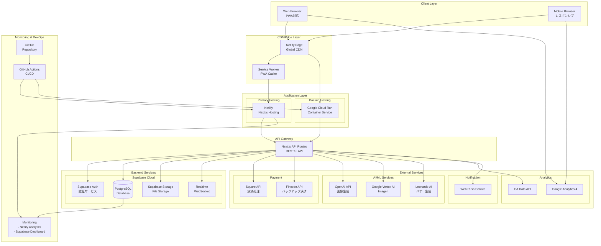

# インフラ構成図 - Aceoripa システムアーキテクチャ

## 1. システム全体構成図



## 2. ネットワーク構成

### 2.1 DNS構成
```yaml
Domain: ace-oripa.com
DNS Provider: Cloudflare / Netlify DNS

Records:
  A Record: @ -> Netlify Load Balancer
  CNAME: www -> ace-oripa.netlify.app
  MX Records: Email Service Provider
  TXT: SPF, DKIM, Domain Verification
```

### 2.2 SSL/TLS構成
```yaml
Certificate: Let's Encrypt (Auto-renewal)
TLS Version: 1.3
HSTS: Enabled (max-age=31536000)
CSP: Content-Security-Policy headers configured
```

### 2.3 CDN構成
```yaml
Provider: Netlify Edge
Locations: Global (20+ edge locations)
Cache Strategy:
  - Static Assets: 1 year
  - HTML: 1 hour
  - API Responses: No cache
  - Images: 7 days
Compression: Brotli, Gzip
```

## 3. コンテナ構成（Google Cloud Run）

### 3.1 Dockerfile構成
```dockerfile
# Base image
FROM node:18-alpine AS base

# Dependencies
FROM base AS deps
WORKDIR /app
COPY package*.json ./
RUN npm ci --only=production

# Builder
FROM base AS builder
WORKDIR /app
COPY . .
RUN npm ci
RUN npm run build

# Runner
FROM base AS runner
WORKDIR /app
ENV NODE_ENV=production
COPY --from=builder /app/.next ./.next
COPY --from=builder /app/public ./public
COPY --from=deps /app/node_modules ./node_modules
COPY --from=builder /app/package.json ./

EXPOSE 8080
CMD ["npm", "start"]
```

### 3.2 Cloud Run設定
```yaml
Service: aceoripa-app
Region: asia-northeast1 (Tokyo)
CPU: 2 vCPU
Memory: 4GB
Min Instances: 1
Max Instances: 100
Concurrency: 1000
Timeout: 300s
```

## 4. データベース構成

### 4.1 Supabase PostgreSQL
```yaml
Provider: Supabase Cloud
Version: PostgreSQL 15
Plan: Pro Plan
Region: Northeast Asia (Tokyo)
Specifications:
  - CPU: 4 vCPUs
  - RAM: 8GB
  - Storage: 100GB SSD
  - Connections: 200 concurrent
  - Bandwidth: 2TB/month
```

### 4.2 バックアップ構成
```yaml
Backup Strategy:
  - Point-in-time Recovery: 7 days
  - Daily Snapshots: 30 days retention
  - Weekly Snapshots: 90 days retention
  - Geo-redundant: Cross-region replication

Disaster Recovery:
  - RTO: 1 hour
  - RPO: 24 hours
  - Failover: Automatic
```

### 4.3 データベース接続
```yaml
Connection Pooling: PgBouncer
Pool Mode: Transaction
Pool Size: 25
Max Client Connections: 200
Connection Timeout: 10s
```

## 5. ストレージ構成

### 5.1 Supabase Storage
```yaml
Storage Buckets:
  - card-images: ポケモンカード画像
  - gacha-banners: ガチャバナー画像
  - user-avatars: ユーザーアバター
  - gacha-videos: ガチャ演出動画

Configuration:
  - Max File Size: 50MB
  - Allowed Types: image/*, video/mp4
  - CDN: Integrated with Supabase CDN
  - Access Control: RLS policies
```

### 5.2 キャッシュ戦略
```yaml
Browser Cache:
  - Images: max-age=604800 (7 days)
  - Videos: max-age=2592000 (30 days)
  - CSS/JS: max-age=31536000 (1 year)

Edge Cache:
  - Static Pages: 3600s
  - API Responses: 0s (no cache)
  - User Content: 300s
```

## 6. セキュリティ構成

### 6.1 ファイアウォール
```yaml
WAF: Netlify Edge Firewall
Rules:
  - Rate Limiting: 100 req/min per IP
  - Geo Blocking: Optional
  - DDoS Protection: Automatic
  - Bot Protection: Challenge suspicious traffic
```

### 6.2 認証・認可
```yaml
Authentication:
  - Provider: Supabase Auth
  - Methods: Email/Password, Google OAuth, LINE Login
  - Session: JWT (1 hour expiry)
  - Refresh Token: 30 days

Authorization:
  - Admin Panel: IP Whitelist + 2FA
  - API Keys: Environment variables
  - CORS: Configured origins only
```

### 6.3 暗号化
```yaml
In Transit:
  - Protocol: HTTPS/TLS 1.3
  - Cipher Suites: Modern only

At Rest:
  - Database: AES-256 encryption
  - Storage: Encrypted at rest
  - Secrets: Environment variables (encrypted)
```

## 7. 監視・ログ構成

### 7.1 アプリケーション監視
```yaml
Metrics:
  - Response Time: < 1s threshold
  - Error Rate: < 1% threshold
  - Uptime: 99.9% SLA
  - CPU/Memory: Auto-scaling triggers

Tools:
  - Netlify Analytics
  - Google Cloud Monitoring
  - Supabase Dashboard
```

### 7.2 ログ管理
```yaml
Application Logs:
  - Location: Netlify Functions Logs
  - Retention: 7 days
  - Level: Info, Warning, Error

Access Logs:
  - Location: Netlify Access Logs
  - Retention: 30 days
  - Format: Combined Log Format

Audit Logs:
  - Admin Actions: Supabase Audit
  - Payment Logs: Square Dashboard
  - Security Events: WAF Logs
```

### 7.3 アラート設定
```yaml
Alerts:
  - High Error Rate: > 5% (Critical)
  - Slow Response: > 3s (Warning)
  - Database Connection: Failed (Critical)
  - Payment Failure: > 10% (Critical)
  - Storage Quota: > 80% (Warning)

Notification Channels:
  - Email: admin@aceoripa.com
  - Slack: #aceoripa-alerts
  - PagerDuty: On-call rotation
```

## 8. CI/CD パイプライン

### 8.1 GitHub Actions Workflow
```yaml
name: Deploy Pipeline

on:
  push:
    branches: [main, develop]
  pull_request:
    branches: [main]

jobs:
  test:
    - Lint (ESLint)
    - Type Check (TypeScript)
    - Unit Tests (Jest)
    - Integration Tests

  build:
    - Next.js Build
    - Docker Image Build
    - Asset Optimization

  deploy:
    - Netlify (Production)
    - Google Cloud Run (Backup)
    - Database Migrations
    - Cache Invalidation
```

### 8.2 環境構成
```yaml
Environments:
  Development:
    - URL: localhost:3000
    - Database: Local Supabase
    - Branch: develop

  Staging:
    - URL: staging.ace-oripa.com
    - Database: Staging Supabase
    - Branch: staging

  Production:
    - URL: ace-oripa.com
    - Database: Production Supabase
    - Branch: main
```

## 9. スケーリング戦略

### 9.1 水平スケーリング
```yaml
Auto-scaling Rules:
  - CPU > 70%: Scale up
  - Memory > 80%: Scale up
  - Request Queue > 100: Scale up
  - Idle Time > 10min: Scale down

Limits:
  - Min Instances: 1
  - Max Instances: 100
  - Scale Up Rate: 2x per minute
  - Scale Down Rate: 50% per 5 minutes
```

### 9.2 垂直スケーリング
```yaml
Resource Tiers:
  Basic:
    - CPU: 1 vCPU
    - Memory: 2GB

  Standard:
    - CPU: 2 vCPU
    - Memory: 4GB

  Premium:
    - CPU: 4 vCPU
    - Memory: 8GB

Upgrade Triggers:
  - Sustained high load
  - Memory pressure
  - Database connection limits
```

## 10. 災害復旧計画

### 10.1 バックアップ戦略
```yaml
Data Backup:
  - Frequency: Daily (Incremental), Weekly (Full)
  - Retention: 30 days (Daily), 90 days (Weekly)
  - Location: Multi-region storage
  - Testing: Monthly restore tests

Code Backup:
  - Repository: GitHub (Primary), GitLab (Mirror)
  - Branches: Protected main branch
  - Tags: Version releases
```

### 10.2 復旧手順
```yaml
Priority 1 (Critical):
  1. Database restoration
  2. Authentication service
  3. Payment processing
  Time: < 1 hour

Priority 2 (High):
  1. Main application
  2. Admin panel
  3. API services
  Time: < 2 hours

Priority 3 (Medium):
  1. Analytics
  2. Image optimization
  3. Background jobs
  Time: < 4 hours
```

## 11. コスト最適化

### 11.1 リソース使用状況
```yaml
Monthly Estimates:
  Netlify: $99 (Pro plan)
  Supabase: $25 (Pro plan)
  Google Cloud: $50-200 (Variable)
  Square: 3.6% per transaction
  OpenAI: $0.02 per image
  Domain/SSL: $20

Total: ~$200-400/month + transaction fees
```

### 11.2 最適化施策
```yaml
Cost Optimization:
  - Edge Caching: Reduce origin requests
  - Image Optimization: WebP format, lazy loading
  - Database Indexes: Query optimization
  - Connection Pooling: Reduce connections
  - Scheduled Scaling: Off-peak reduction
  - Reserved Instances: Long-term discounts
```

## 12. コンプライアンス

### 12.1 データ保護
```yaml
GDPR Compliance:
  - Data Encryption: AES-256
  - Right to Deletion: User data purge
  - Data Portability: Export functionality
  - Privacy Policy: Updated regularly

Japanese Regulations:
  - 個人情報保護法: Compliant
  - 特定商取引法: Terms displayed
  - 資金決済法: Payment regulations
```

### 12.2 セキュリティ認証
```yaml
Standards:
  - PCI DSS: Level 1 (via Square)
  - SSL/TLS: A+ rating
  - OWASP: Top 10 protection
  - ISO 27001: Planned
```

---

*作成日: 2025年1月*
*バージョン: 1.0.0*
*作成者: Aceoripa開発チーム*