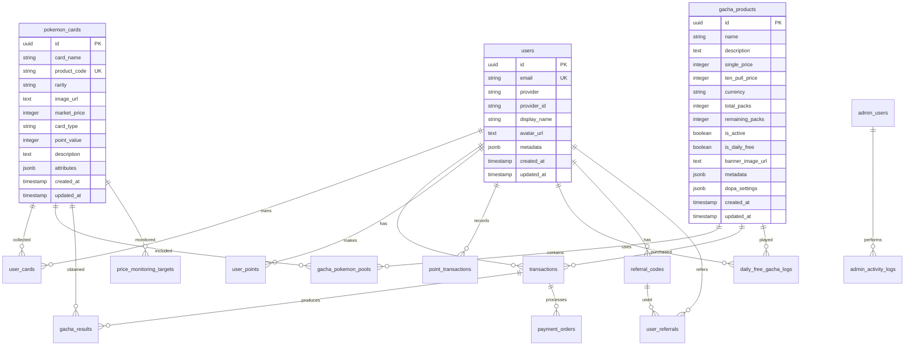

# データベース設計書 - Aceoripa Database Schema

## 1. データベース概要

### 1.1 基本情報
```yaml
DBMS: PostgreSQL 15
Provider: Supabase Cloud
Character Set: UTF-8
Timezone: Asia/Tokyo (JST)
Collation: ja_JP.UTF-8
```

### 1.2 命名規則
- **テーブル名**: 複数形、スネークケース（例: `pokemon_cards`）
- **カラム名**: スネークケース（例: `created_at`）
- **主キー**: `id` (UUID)
- **外部キー**: `{参照テーブル名}_id`（例: `user_id`）
- **インデックス**: `idx_{テーブル名}_{カラム名}`
- **制約**: `{テーブル名}_{制約タイプ}_{カラム名}`

## 2. ER図



## 3. テーブル定義詳細

### 3.1 ユーザー管理テーブル

#### users（ユーザー）
| カラム名 | データ型 | NULL | デフォルト | 説明 |
|---------|----------|------|------------|------|
| id | UUID | NO | uuid_generate_v4() | 主キー |
| email | VARCHAR(255) | NO | - | メールアドレス（ユニーク） |
| provider | VARCHAR(50) | YES | - | 認証プロバイダ（google, line等） |
| provider_id | VARCHAR(255) | YES | - | プロバイダ側のユーザーID |
| display_name | VARCHAR(255) | YES | - | 表示名 |
| avatar_url | TEXT | YES | - | アバター画像URL |
| metadata | JSONB | YES | {} | メタデータ |
| created_at | TIMESTAMPTZ | NO | CURRENT_TIMESTAMP | 作成日時 |
| updated_at | TIMESTAMPTZ | NO | CURRENT_TIMESTAMP | 更新日時 |

**インデックス:**
- `idx_users_email` (email)
- `idx_users_provider` (provider, provider_id)

#### admin_users（管理者）
| カラム名 | データ型 | NULL | デフォルト | 説明 |
|---------|----------|------|------------|------|
| id | UUID | NO | uuid_generate_v4() | 主キー |
| email | VARCHAR(255) | NO | - | メールアドレス（ユニーク） |
| password_hash | VARCHAR(255) | NO | - | パスワードハッシュ |
| role | VARCHAR(50) | NO | 'admin' | 権限（admin, super_admin） |
| is_active | BOOLEAN | NO | true | アクティブフラグ |
| last_login_at | TIMESTAMPTZ | YES | - | 最終ログイン日時 |
| created_at | TIMESTAMPTZ | NO | CURRENT_TIMESTAMP | 作成日時 |

### 3.2 カード管理テーブル

#### pokemon_cards（ポケモンカードマスタ）
| カラム名 | データ型 | NULL | デフォルト | 説明 |
|---------|----------|------|------------|------|
| id | UUID | NO | uuid_generate_v4() | 主キー |
| card_name | VARCHAR(255) | NO | - | カード名 |
| product_code | VARCHAR(100) | NO | - | 商品コード（ユニーク） |
| rarity | VARCHAR(10) | NO | - | レアリティ（SS,S,A,B,C） |
| image_url | TEXT | YES | - | カード画像URL |
| market_price | INTEGER | YES | 0 | 市場価格（円） |
| card_type | VARCHAR(20) | NO | 'physical' | カードタイプ |
| point_value | INTEGER | YES | 0 | ポイント還元値 |
| description | TEXT | YES | - | 説明 |
| attributes | JSONB | YES | {} | 属性情報 |
| created_at | TIMESTAMPTZ | NO | CURRENT_TIMESTAMP | 作成日時 |
| updated_at | TIMESTAMPTZ | NO | CURRENT_TIMESTAMP | 更新日時 |

**インデックス:**
- `idx_pokemon_cards_product_code` (product_code)
- `idx_pokemon_cards_rarity` (rarity)
- `idx_pokemon_cards_card_type` (card_type)
- `idx_pokemon_cards_market_price` (market_price)

**カードタイプ:**
- `physical`: 物理カード
- `point_return`: ポイント還元カード
- `bonus_pack`: お楽しみパック

#### user_cards（ユーザー所持カード）
| カラム名 | データ型 | NULL | デフォルト | 説明 |
|---------|----------|------|------------|------|
| id | UUID | NO | uuid_generate_v4() | 主キー |
| user_id | UUID | NO | - | ユーザーID（FK） |
| card_id | UUID | NO | - | カードID（FK） |
| obtained_at | TIMESTAMPTZ | NO | CURRENT_TIMESTAMP | 獲得日時 |
| is_favorite | BOOLEAN | NO | false | お気に入りフラグ |
| transaction_id | UUID | YES | - | 取引ID（FK） |

**インデックス:**
- `idx_user_cards_user_id` (user_id)
- `idx_user_cards_card_id` (card_id)
- `idx_user_cards_obtained_at` (obtained_at)

### 3.3 ガチャ管理テーブル

#### gacha_products（ガチャ商品）
| カラム名 | データ型 | NULL | デフォルト | 説明 |
|---------|----------|------|------------|------|
| id | UUID | NO | uuid_generate_v4() | 主キー |
| name | VARCHAR(255) | NO | - | ガチャ名 |
| description | TEXT | YES | - | 説明 |
| single_price | INTEGER | NO | - | 単発価格（ポイント） |
| ten_pull_price | INTEGER | YES | - | 10連価格（ポイント） |
| currency | VARCHAR(10) | NO | 'POINTS' | 通貨種別 |
| total_packs | INTEGER | NO | 0 | 総パック数 |
| remaining_packs | INTEGER | NO | 0 | 残りパック数 |
| is_active | BOOLEAN | NO | true | 販売中フラグ |
| is_daily_free | BOOLEAN | NO | false | 無料ガチャフラグ |
| banner_image_url | TEXT | YES | - | バナー画像URL |
| metadata | JSONB | YES | {} | メタデータ |
| dopa_settings | JSONB | YES | {} | DOPA式設定 |
| created_at | TIMESTAMPTZ | NO | CURRENT_TIMESTAMP | 作成日時 |
| updated_at | TIMESTAMPTZ | NO | CURRENT_TIMESTAMP | 更新日時 |

**DOPA設定構造:**
```json
{
  "actual_return_rate": 0.70,
  "display_return_rate": 0.97,
  "explosion_ad_rate": 0.15,
  "point_return_distribution": {
    "low_return": {"min": 850, "max": 3650, "weight": 400},
    "mid_return": {"min": 5600, "max": 8900, "weight": 300},
    "high_return": {"min": 12000, "max": 15000, "weight": 120},
    "super_return": {"min": 20000, "max": 25000, "weight": 30}
  }
}
```

#### gacha_pokemon_pools（ガチャ排出設定）
| カラム名 | データ型 | NULL | デフォルト | 説明 |
|---------|----------|------|------------|------|
| id | UUID | NO | uuid_generate_v4() | 主キー |
| gacha_product_id | UUID | NO | - | ガチャ商品ID（FK） |
| card_id | UUID | NO | - | カードID（FK） |
| weight | INTEGER | NO | 100 | 排出重み |
| stock_limit | INTEGER | YES | - | 在庫上限 |
| current_stock | INTEGER | YES | - | 現在在庫 |
| is_pickup | BOOLEAN | NO | false | ピックアップフラグ |
| created_at | TIMESTAMPTZ | NO | CURRENT_TIMESTAMP | 作成日時 |

**インデックス:**
- `idx_gacha_pools_product` (gacha_product_id)
- `idx_gacha_pools_card` (card_id)
- `idx_gacha_pools_weight` (weight)

### 3.4 取引・決済テーブル

#### transactions（取引履歴）
| カラム名 | データ型 | NULL | デフォルト | 説明 |
|---------|----------|------|------------|------|
| id | UUID | NO | uuid_generate_v4() | 主キー |
| user_id | UUID | NO | - | ユーザーID（FK） |
| product_id | UUID | NO | - | 商品ID（FK） |
| amount | INTEGER | NO | - | 金額 |
| currency | VARCHAR(10) | NO | 'JPY' | 通貨 |
| status | VARCHAR(50) | NO | - | ステータス |
| payment_method | VARCHAR(50) | YES | - | 決済方法 |
| payment_id | VARCHAR(255) | YES | - | 外部決済ID |
| metadata | JSONB | YES | {} | メタデータ |
| created_at | TIMESTAMPTZ | NO | CURRENT_TIMESTAMP | 作成日時 |
| completed_at | TIMESTAMPTZ | YES | - | 完了日時 |

**ステータス値:**
- `pending`: 処理中
- `completed`: 完了
- `failed`: 失敗
- `refunded`: 返金済み

#### payment_orders（決済注文）
| カラム名 | データ型 | NULL | デフォルト | 説明 |
|---------|----------|------|------------|------|
| id | UUID | NO | uuid_generate_v4() | 主キー |
| order_id | VARCHAR(255) | NO | - | 注文ID（ユニーク） |
| user_id | UUID | NO | - | ユーザーID（FK） |
| amount | INTEGER | NO | - | 金額 |
| provider | VARCHAR(50) | NO | - | 決済プロバイダ |
| provider_order_id | VARCHAR(255) | YES | - | プロバイダ側注文ID |
| status | VARCHAR(50) | NO | 'pending' | ステータス |
| metadata | JSONB | YES | {} | メタデータ |
| created_at | TIMESTAMPTZ | NO | CURRENT_TIMESTAMP | 作成日時 |
| updated_at | TIMESTAMPTZ | NO | CURRENT_TIMESTAMP | 更新日時 |

### 3.5 ポイント管理テーブル

#### user_points（ユーザーポイント）
| カラム名 | データ型 | NULL | デフォルト | 説明 |
|---------|----------|------|------------|------|
| id | UUID | NO | uuid_generate_v4() | 主キー |
| user_id | UUID | NO | - | ユーザーID（FK、ユニーク） |
| free_points | INTEGER | NO | 0 | 無料ポイント |
| paid_points | INTEGER | NO | 0 | 有料ポイント |
| total_points | INTEGER | NO | 0 | 合計ポイント（計算列） |
| updated_at | TIMESTAMPTZ | NO | CURRENT_TIMESTAMP | 更新日時 |

#### point_transactions（ポイント取引履歴）
| カラム名 | データ型 | NULL | デフォルト | 説明 |
|---------|----------|------|------------|------|
| id | UUID | NO | uuid_generate_v4() | 主キー |
| user_id | UUID | NO | - | ユーザーID（FK） |
| amount | INTEGER | NO | - | ポイント数 |
| type | VARCHAR(50) | NO | - | 取引タイプ |
| is_paid | BOOLEAN | NO | false | 有料ポイントフラグ |
| description | TEXT | YES | - | 説明 |
| reference_id | UUID | YES | - | 参照ID |
| created_at | TIMESTAMPTZ | NO | CURRENT_TIMESTAMP | 作成日時 |

**取引タイプ:**
- `purchase`: 購入
- `use`: 使用
- `bonus`: ボーナス
- `refund`: 返金
- `point_return`: ポイント還元

### 3.6 無料ガチャ・キャンペーンテーブル

#### daily_free_gacha_logs（1日1回無料ガチャログ）
| カラム名 | データ型 | NULL | デフォルト | 説明 |
|---------|----------|------|------------|------|
| id | UUID | NO | uuid_generate_v4() | 主キー |
| user_id | UUID | NO | - | ユーザーID（FK） |
| gacha_product_id | UUID | NO | - | ガチャ商品ID（FK） |
| used_at | TIMESTAMPTZ | NO | CURRENT_TIMESTAMP | 使用日時 |
| reset_date | DATE | NO | CURRENT_DATE | リセット日付 |
| created_at | TIMESTAMPTZ | NO | CURRENT_TIMESTAMP | 作成日時 |

**ユニーク制約:**
- `(user_id, gacha_product_id, reset_date)`

#### referral_codes（紹介コード）
| カラム名 | データ型 | NULL | デフォルト | 説明 |
|---------|----------|------|------------|------|
| id | UUID | NO | uuid_generate_v4() | 主キー |
| user_id | UUID | NO | - | ユーザーID（FK） |
| code | VARCHAR(20) | NO | - | 紹介コード（ユニーク） |
| is_active | BOOLEAN | NO | true | 有効フラグ |
| created_at | TIMESTAMPTZ | NO | CURRENT_TIMESTAMP | 作成日時 |

### 3.7 市場価格監視テーブル

#### price_monitoring_targets（価格監視対象）
| カラム名 | データ型 | NULL | デフォルト | 説明 |
|---------|----------|------|------------|------|
| id | UUID | NO | uuid_generate_v4() | 主キー |
| card_id | UUID | NO | - | カードID（FK） |
| monitoring_url | TEXT | YES | - | 監視URL |
| platform | VARCHAR(50) | NO | - | プラットフォーム |
| target_price | INTEGER | YES | - | 目標価格 |
| alert_threshold | DECIMAL(5,2) | YES | 20.00 | アラート閾値（%） |
| is_active | BOOLEAN | NO | true | 監視中フラグ |
| last_checked_at | TIMESTAMPTZ | YES | - | 最終確認日時 |
| created_at | TIMESTAMPTZ | NO | CURRENT_TIMESTAMP | 作成日時 |

**プラットフォーム:**
- `cardrush`: カードラッシュ
- `mercari`: メルカリ
- `yahoo`: ヤフオク

#### price_history（価格履歴）
| カラム名 | データ型 | NULL | デフォルト | 説明 |
|---------|----------|------|------------|------|
| id | UUID | NO | uuid_generate_v4() | 主キー |
| card_id | UUID | NO | - | カードID（FK） |
| platform | VARCHAR(50) | NO | - | プラットフォーム |
| price | INTEGER | NO | - | 価格 |
| stock_status | VARCHAR(50) | YES | - | 在庫状況 |
| recorded_at | TIMESTAMPTZ | NO | CURRENT_TIMESTAMP | 記録日時 |

### 3.8 AI最適化テーブル

#### gacha_optimization_history（ガチャ最適化履歴）
| カラム名 | データ型 | NULL | デフォルト | 説明 |
|---------|----------|------|------------|------|
| id | UUID | NO | uuid_generate_v4() | 主キー |
| gacha_product_id | UUID | NO | - | ガチャ商品ID（FK） |
| optimization_type | VARCHAR(50) | NO | - | 最適化タイプ |
| before_settings | JSONB | NO | {} | 変更前設定 |
| after_settings | JSONB | NO | {} | 変更後設定 |
| metrics | JSONB | YES | {} | メトリクス |
| applied_at | TIMESTAMPTZ | YES | - | 適用日時 |
| created_at | TIMESTAMPTZ | NO | CURRENT_TIMESTAMP | 作成日時 |

**最適化タイプ:**
- `market_price`: 市場価格調整
- `stock_balance`: 在庫バランス
- `profit_optimization`: 利益最適化
- `user_satisfaction`: ユーザー満足度

## 4. ビュー定義

### 4.1 gacha_dopa_probability（DOPA式確率計算ビュー）
```sql
CREATE VIEW gacha_dopa_probability AS
SELECT
  gp.id as gacha_product_id,
  gp.name as gacha_name,
  gp.single_price,
  gp.dopa_settings,
  COALESCE((gp.dopa_settings->>'actual_return_rate')::numeric, 0.70) as actual_return_rate,
  COALESCE((gp.dopa_settings->>'display_return_rate')::numeric, 0.97) as display_return_rate,
  gp.single_price * 0.7 as expected_user_spend_per_round,
  gp.single_price - (gp.single_price * 0.7) as revenue_per_round
FROM gacha_products gp
WHERE gp.is_active = true;
```

### 4.2 user_statistics（ユーザー統計ビュー）
```sql
CREATE VIEW user_statistics AS
SELECT
  u.id,
  u.email,
  u.display_name,
  COUNT(DISTINCT uc.card_id) as unique_cards,
  COUNT(uc.id) as total_cards,
  COALESCE(up.total_points, 0) as current_points,
  COUNT(DISTINCT t.id) as total_transactions,
  SUM(t.amount) FILTER (WHERE t.status = 'completed') as total_spent,
  u.created_at as member_since
FROM users u
LEFT JOIN user_cards uc ON u.id = uc.user_id
LEFT JOIN user_points up ON u.id = up.user_id
LEFT JOIN transactions t ON u.id = t.user_id
GROUP BY u.id, u.email, u.display_name, up.total_points, u.created_at;
```

## 5. ストアドプロシージャ・関数

### 5.1 ガチャ実行関数
```sql
CREATE OR REPLACE FUNCTION execute_gacha(
  p_user_id UUID,
  p_gacha_product_id UUID,
  p_count INTEGER DEFAULT 1
) RETURNS TABLE(card_id UUID, card_name VARCHAR, rarity VARCHAR) AS $$
DECLARE
  v_total_weight INTEGER;
  v_random_weight INTEGER;
  v_selected_card_id UUID;
BEGIN
  -- ポイント確認・消費処理
  -- 重み付き抽選処理
  -- 結果記録
  -- カード返却
END;
$$ LANGUAGE plpgsql;
```

### 5.2 DOPA式プール生成関数
```sql
CREATE OR REPLACE FUNCTION generate_dopa_gacha_pool(
  p_gacha_product_id UUID,
  p_total_weight INTEGER DEFAULT 1000
) RETURNS INTEGER AS $$
BEGIN
  -- 物理カード15%、ポイント還元85%の配分で生成
  -- 詳細は実装済みコード参照
END;
$$ LANGUAGE plpgsql;
```

## 6. トリガー定義

### 6.1 updated_at自動更新トリガー
```sql
CREATE OR REPLACE FUNCTION update_updated_at_column()
RETURNS TRIGGER AS $$
BEGIN
  NEW.updated_at = CURRENT_TIMESTAMP;
  RETURN NEW;
END;
$$ LANGUAGE plpgsql;

-- 各テーブルに適用
CREATE TRIGGER update_users_updated_at
  BEFORE UPDATE ON users
  FOR EACH ROW EXECUTE FUNCTION update_updated_at_column();
```

### 6.2 ポイント合計自動計算トリガー
```sql
CREATE OR REPLACE FUNCTION calculate_total_points()
RETURNS TRIGGER AS $$
BEGIN
  NEW.total_points = NEW.free_points + NEW.paid_points;
  RETURN NEW;
END;
$$ LANGUAGE plpgsql;

CREATE TRIGGER calculate_user_points_total
  BEFORE INSERT OR UPDATE ON user_points
  FOR EACH ROW EXECUTE FUNCTION calculate_total_points();
```

## 7. インデックス戦略

### 7.1 パフォーマンスインデックス
```sql
-- 頻繁に検索されるカラム
CREATE INDEX idx_pokemon_cards_rarity_price ON pokemon_cards(rarity, market_price);
CREATE INDEX idx_gacha_products_active ON gacha_products(is_active) WHERE is_active = true;
CREATE INDEX idx_transactions_user_status ON transactions(user_id, status);

-- 日付範囲検索用
CREATE INDEX idx_transactions_created_at ON transactions(created_at);
CREATE INDEX idx_user_cards_obtained_at ON user_cards(obtained_at);

-- 複合インデックス
CREATE INDEX idx_gacha_pools_composite ON gacha_pokemon_pools(gacha_product_id, weight DESC);
```

### 7.2 ユニーク制約
```sql
-- ビジネスルール保証
ALTER TABLE pokemon_cards ADD CONSTRAINT uk_pokemon_cards_product_code UNIQUE(product_code);
ALTER TABLE users ADD CONSTRAINT uk_users_email UNIQUE(email);
ALTER TABLE referral_codes ADD CONSTRAINT uk_referral_codes_code UNIQUE(code);
ALTER TABLE daily_free_gacha_logs ADD CONSTRAINT uk_daily_free_gacha
  UNIQUE(user_id, gacha_product_id, reset_date);
```

## 8. セキュリティ設定

### 8.1 Row Level Security (RLS)
```sql
-- ユーザーは自分のデータのみアクセス可能
ALTER TABLE users ENABLE ROW LEVEL SECURITY;

CREATE POLICY users_read_own ON users
  FOR SELECT USING (auth.uid() = id);

CREATE POLICY users_update_own ON users
  FOR UPDATE USING (auth.uid() = id);

-- 同様に他テーブルにも適用
```

### 8.2 権限設定
```sql
-- アプリケーションユーザー
GRANT SELECT, INSERT, UPDATE ON ALL TABLES IN SCHEMA public TO app_user;
GRANT USAGE, SELECT ON ALL SEQUENCES IN SCHEMA public TO app_user;

-- 読み取り専用ユーザー
GRANT SELECT ON ALL TABLES IN SCHEMA public TO readonly_user;

-- 管理者
GRANT ALL PRIVILEGES ON ALL TABLES IN SCHEMA public TO admin_user;
```

## 9. バックアップ・リカバリ戦略

### 9.1 バックアップポリシー
```yaml
Point-in-time Recovery:
  - Retention: 7 days
  - Frequency: Continuous

Logical Backup:
  - Daily: Full backup at 3:00 AM JST
  - Retention: 30 days
  - Storage: Cross-region replication

Physical Backup:
  - Weekly: Sunday 3:00 AM JST
  - Retention: 90 days
  - Storage: Cold storage
```

### 9.2 リストア手順
```sql
-- Point-in-time Recovery
SELECT * FROM pg_restore_point('2025-01-15 12:00:00'::timestamp);

-- Logical Restore
pg_restore -d aceoripa_db backup_20250115.dump

-- Table-level Restore
pg_restore -t pokemon_cards -d aceoripa_db backup_20250115.dump
```

## 10. パフォーマンスチューニング

### 10.1 クエリ最適化
```sql
-- EXPLAIN ANALYZEによる実行計画確認
EXPLAIN ANALYZE
SELECT * FROM gacha_pokemon_pools
WHERE gacha_product_id = '...'
ORDER BY weight DESC;

-- 統計情報の更新
ANALYZE pokemon_cards;
VACUUM ANALYZE gacha_pokemon_pools;
```

### 10.2 接続プール設定
```yaml
PgBouncer Configuration:
  pool_mode: transaction
  max_client_conn: 200
  default_pool_size: 25
  reserve_pool_size: 5
  reserve_pool_timeout: 3
  server_lifetime: 3600
  server_idle_timeout: 600
```

---

*作成日: 2025年1月*
*バージョン: 1.0.0*
*作成者: Aceoripa開発チーム*