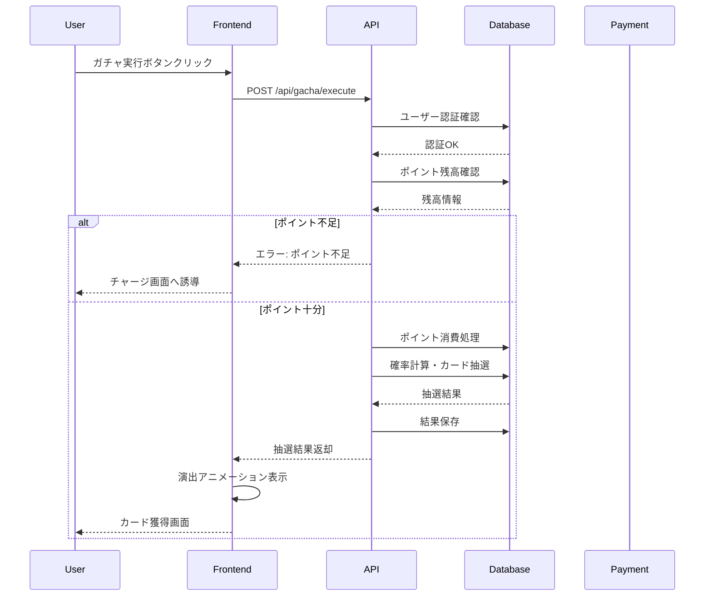
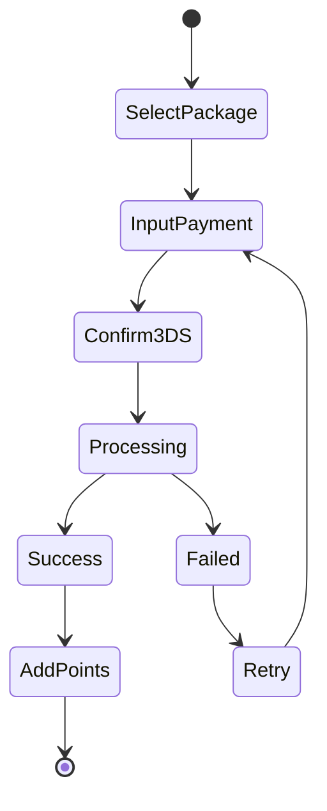
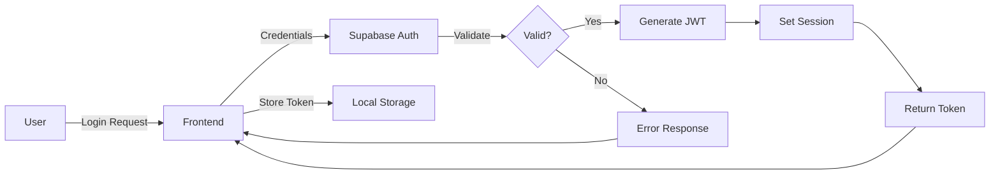
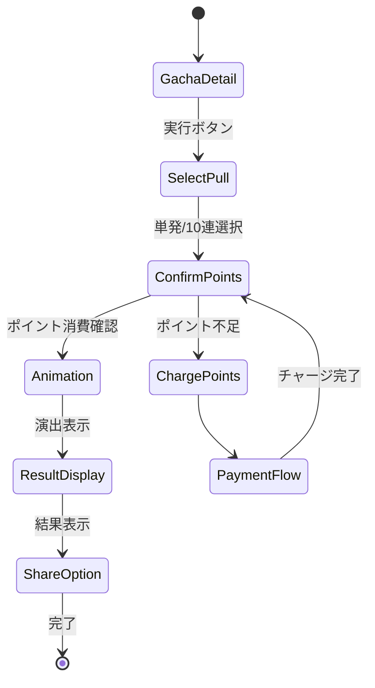

# 概要・詳細設計書 - Aceoripa System Detailed Design

## 1. システム概要設計

### 1.1 システム全体像
```
┌─────────────────────────────────────────────────────────────┐
│                         Aceoripa System                       │
├───────────────┬───────────────┬───────────────┬──────────────┤
│  Frontend     │   Backend     │   Database    │  External    │
│  - Next.js    │  - API Routes │  - Supabase   │  - Square    │
│  - React      │  - Auth       │  - PostgreSQL │  - OpenAI    │
│  - PWA        │  - Business   │  - Storage    │  - Analytics │
└───────────────┴───────────────┴───────────────┴──────────────┘
```

### 1.2 アプリケーション層設計

#### レイヤーアーキテクチャ
```
┌──────────────────────────────────┐
│     Presentation Layer           │ ← UI/UX, Components
├──────────────────────────────────┤
│     Application Layer            │ ← Business Logic
├──────────────────────────────────┤
│     Domain Layer                 │ ← Core Models
├──────────────────────────────────┤
│     Infrastructure Layer         │ ← DB, External APIs
└──────────────────────────────────┘
```

### 1.3 コンポーネント構成
```yaml
Frontend Components:
  Layout:
    - Header
    - Footer
    - Navigation
    - AuthHeader

  Pages:
    - Home
    - Gacha
    - MyPage
    - Admin

  Features:
    - GachaAnimation
    - CardCollection
    - PointManager
    - PaymentFlow

Backend Services:
  Auth:
    - UserAuthentication
    - AdminAuthentication
    - SessionManagement

  Gacha:
    - GachaExecution
    - ProbabilityCalculation
    - DOPASystem

  Payment:
    - SquareIntegration
    - FincodeIntegration
    - PointTransaction

  Analytics:
    - UserTracking
    - RevenueAnalysis
    - OptimizationEngine
```

## 2. 機能詳細設計

### 2.1 ガチャシステム

#### 2.1.1 ガチャ実行フロー


#### 2.1.2 DOPA式確率計算アルゴリズム
```typescript
interface DOPACalculation {
  // 基本パラメータ
  basePrice: number;           // 基本価格（10,000円）
  actualReturnRate: number;    // 実質還元率（70%）
  displayReturnRate: number;   // 体感還元率（97%）

  // カード配分
  physicalCardRate: number;    // 物理カード率（15%）
  pointReturnRate: number;     // ポイント還元率（85%）

  // 計算メソッド
  calculateWeight(card: Card): number;
  selectCard(pool: CardPool[]): Card;
  applyMarketStrategy(weight: number, marketPrice: number): number;
}

// 実装例
function calculateDOPAWeight(
  card: Card,
  settings: DOPASettings
): number {
  let weight = card.baseWeight;

  // カードタイプによる調整
  if (card.type === 'physical') {
    weight *= 0.15; // 物理カード15%
  } else if (card.type === 'point_return') {
    weight *= 0.85; // ポイント還元85%

    // ポイント価値による細分化
    if (card.pointValue >= 12000) {
      weight *= settings.explosionAdRate; // 爆アド率
    }
  }

  // 市場価格戦略の適用
  if (card.marketPrice) {
    weight = applyMarketStrategy(weight, card.marketPrice);
  }

  return weight;
}
```

### 2.2 決済システム

#### 2.2.1 決済フロー設計


#### 2.2.2 Square決済実装
```typescript
// Square決済インターフェース
interface SquarePayment {
  createPayment(request: PaymentRequest): Promise<PaymentResult>;
  verifyWebhook(signature: string, body: string): boolean;
  refundPayment(paymentId: string, amount: number): Promise<RefundResult>;
}

// 実装
class SquarePaymentService implements SquarePayment {
  private client: Square.Client;

  async createPayment(request: PaymentRequest): Promise<PaymentResult> {
    try {
      // 冪等性キーの生成
      const idempotencyKey = generateIdempotencyKey();

      // 決済リクエスト作成
      const payment = await this.client.paymentsApi.createPayment({
        sourceId: request.sourceId,
        idempotencyKey,
        amountMoney: {
          amount: BigInt(request.amount),
          currency: 'JPY'
        },
        buyerEmailAddress: request.email,
        referenceId: request.orderId
      });

      return {
        success: true,
        paymentId: payment.result.payment.id,
        status: payment.result.payment.status
      };
    } catch (error) {
      return {
        success: false,
        error: error.message
      };
    }
  }
}
```

### 2.3 ユーザー認証システム

#### 2.3.1 認証フロー


#### 2.3.2 セッション管理
```typescript
// セッション管理クラス
class SessionManager {
  private readonly SESSION_KEY = 'aceoripa_session';
  private readonly REFRESH_THRESHOLD = 5 * 60 * 1000; // 5分

  async validateSession(): Promise<boolean> {
    const session = this.getSession();

    if (!session) return false;

    // トークン有効期限チェック
    const expiresAt = new Date(session.expires_at);
    const now = new Date();

    if (expiresAt <= now) {
      // 期限切れ
      await this.refreshSession();
      return this.validateSession();
    }

    // リフレッシュ閾値チェック
    if (expiresAt.getTime() - now.getTime() < this.REFRESH_THRESHOLD) {
      // バックグラウンドでリフレッシュ
      this.refreshSession();
    }

    return true;
  }

  private async refreshSession(): Promise<void> {
    const { data, error } = await supabase.auth.refreshSession();
    if (error) throw error;
    this.setSession(data.session);
  }
}
```

### 2.4 管理画面機能

#### 2.4.1 ダッシュボード設計
```yaml
Dashboard Components:
  RealTimeStats:
    - ActiveUsers: 現在のアクティブユーザー数
    - TodayRevenue: 本日の売上
    - GachaCount: 本日のガチャ実行回数
    - NewUsers: 新規登録ユーザー数

  Charts:
    - RevenueChart: 売上推移グラフ（日/週/月）
    - UserChart: ユーザー数推移
    - GachaChart: ガチャ実行推移
    - CardDistribution: カード排出分布

  Tables:
    - RecentTransactions: 最新取引一覧
    - TopUsers: 上位課金ユーザー
    - PopularGacha: 人気ガチャランキング
    - LowStockCards: 在庫僅少カード
```

#### 2.4.2 ガチャ管理画面
```typescript
// ガチャ管理インターフェース
interface GachaManagement {
  // CRUD操作
  createGacha(data: GachaData): Promise<Gacha>;
  updateGacha(id: string, data: Partial<GachaData>): Promise<Gacha>;
  deleteGacha(id: string): Promise<void>;

  // プール管理
  setCardPool(gachaId: string, cards: CardPoolItem[]): Promise<void>;
  updateWeights(gachaId: string, weights: WeightUpdate[]): Promise<void>;

  // DOPA設定
  configureDOPA(gachaId: string, settings: DOPASettings): Promise<void>;
  calculateProfit(gachaId: string): Promise<ProfitCalculation>;

  // AI最適化
  runOptimization(gachaId: string): Promise<OptimizationResult>;
  applyOptimization(gachaId: string, result: OptimizationResult): Promise<void>;
}
```

## 3. API詳細設計

### 3.1 RESTful API エンドポイント

#### 認証系API
```yaml
POST /api/auth/signup:
  Description: 新規ユーザー登録
  Request:
    - email: string
    - password: string
    - displayName?: string
  Response:
    - user: User
    - session: Session

POST /api/auth/login:
  Description: ログイン
  Request:
    - email: string
    - password: string
  Response:
    - user: User
    - session: Session

POST /api/auth/logout:
  Description: ログアウト
  Response:
    - success: boolean

GET /api/auth/me:
  Description: 現在のユーザー情報取得
  Response:
    - user: User | null
```

#### ガチャ系API
```yaml
GET /api/gacha/products:
  Description: ガチャ商品一覧取得
  Query:
    - active?: boolean
    - category?: string
  Response:
    - products: GachaProduct[]

GET /api/gacha/products/{id}:
  Description: ガチャ商品詳細取得
  Response:
    - product: GachaProduct
    - pool: CardPool[]

POST /api/gacha/{id}/execute:
  Description: ガチャ実行
  Request:
    - count: number (1 or 10)
  Response:
    - results: Card[]
    - animation: AnimationData

POST /api/gacha/{id}/execute-dopa:
  Description: DOPA式ガチャ実行
  Request:
    - count: number
  Response:
    - results: Card[]
    - pointReturns: PointReturn[]

GET /api/gacha/free/check:
  Description: 無料ガチャ利用可能確認
  Response:
    - available: boolean
    - nextResetTime: Date
```

#### 決済系API
```yaml
POST /api/payment/process:
  Description: 決済処理
  Request:
    - packageId: string
    - paymentMethod: string
    - sourceId?: string
  Response:
    - success: boolean
    - paymentId: string
    - points: number

POST /api/payment/packages:
  Description: ポイントパッケージ一覧
  Response:
    - packages: PointPackage[]

POST /api/point-exchange:
  Description: ポイント交換
  Request:
    - cardId: string
    - quantity: number
  Response:
    - points: number
    - transaction: Transaction
```

#### 管理系API
```yaml
GET /api/admin/dashboard:
  Description: ダッシュボードデータ取得
  Response:
    - stats: DashboardStats
    - charts: ChartData[]

GET /api/admin/analytics:
  Description: Google Analytics データ取得
  Query:
    - startDate: string
    - endDate: string
    - metrics: string[]
  Response:
    - data: AnalyticsData

POST /api/admin/gacha/bulk-create:
  Description: ガチャ一括作成
  Request:
    - templates: GachaTemplate[]
  Response:
    - created: Gacha[]

POST /api/admin/gacha/{id}/ai-optimize:
  Description: AI最適化実行
  Response:
    - optimization: OptimizationResult
    - recommendations: Recommendation[]
```

### 3.2 WebSocket リアルタイム通信

#### リアルタイムイベント
```typescript
// Supabase Realtime設定
const subscription = supabase
  .channel('gacha-updates')
  .on('postgres_changes', {
    event: '*',
    schema: 'public',
    table: 'gacha_products'
  }, (payload) => {
    handleGachaUpdate(payload);
  })
  .on('presence', {
    event: 'sync'
  }, () => {
    updateOnlineUsers();
  })
  .subscribe();

// イベントタイプ
enum RealtimeEvent {
  GACHA_UPDATED = 'gacha.updated',
  STOCK_CHANGED = 'stock.changed',
  PRICE_ALERT = 'price.alert',
  USER_WON_RARE = 'user.won.rare',
  CAMPAIGN_STARTED = 'campaign.started'
}
```

## 4. 画面詳細設計

### 4.1 トップページ

#### レイアウト構成
```
┌──────────────────────────────────────┐
│          Header Navigation           │
├──────────────────────────────────────┤
│                                      │
│        Hero Banner Swiper            │
│         (Campaign Images)            │
│                                      │
├──────────────────────────────────────┤
│     🎯 Featured Gacha Section        │
│  ┌────────┐ ┌────────┐ ┌────────┐  │
│  │ Gacha1 │ │ Gacha2 │ │ Gacha3 │  │
│  └────────┘ └────────┘ └────────┘  │
├──────────────────────────────────────┤
│     🆕 New Arrivals                  │
│  ┌────────┐ ┌────────┐ ┌────────┐  │
│  │  New1  │ │  New2  │ │  New3  │  │
│  └────────┘ └────────┘ └────────┘  │
├──────────────────────────────────────┤
│     🏆 Ranking                       │
│  1. High Value Card A                │
│  2. High Value Card B                │
│  3. High Value Card C                │
├──────────────────────────────────────┤
│           Footer                     │
└──────────────────────────────────────┘
```

### 4.2 ガチャ実行画面

#### 画面遷移フロー


### 4.3 管理画面ダッシュボード

#### ウィジェット配置
```
┌─────────────────────────────────────────────────┐
│              Admin Dashboard                    │
├──────────────┬──────────────┬──────────────────┤
│   Revenue    │   Users      │   Gacha Count    │
│   ¥1,234,567 │   1,234      │   5,678         │
├──────────────┴──────────────┴──────────────────┤
│                                                 │
│         Revenue Chart (Line Graph)             │
│                                                 │
├─────────────────────────────────────────────────┤
│  Recent Transactions Table                     │
│  ┌──────┬─────────┬──────────┬────────────┐   │
│  │ User │ Amount  │ Product  │ Time       │   │
│  ├──────┼─────────┼──────────┼────────────┤   │
│  │ ...  │ ...     │ ...      │ ...        │   │
│  └──────┴─────────┴──────────┴────────────┘   │
├─────────────────────────────────────────────────┤
│  Quick Actions                                 │
│  [Create Gacha] [View Reports] [Settings]      │
└─────────────────────────────────────────────────┘
```

## 5. セキュリティ詳細設計

### 5.1 認証・認可マトリクス

| リソース | 未認証 | 一般ユーザー | 管理者 |
|---------|--------|-------------|--------|
| トップページ | ✓ | ✓ | ✓ |
| ガチャ一覧 | ✓ | ✓ | ✓ |
| ガチャ実行 | × | ✓ | ✓ |
| マイページ | × | ✓（自分のみ） | ✓ |
| 管理画面 | × | × | ✓ |
| API (Public) | ✓ | ✓ | ✓ |
| API (Auth) | × | ✓ | ✓ |
| API (Admin) | × | × | ✓ |

### 5.2 セキュリティ対策実装

#### XSS対策
```typescript
// Content Security Policy設定
const cspHeader = `
  default-src 'self';
  script-src 'self' 'unsafe-inline' 'unsafe-eval' https://www.googletagmanager.com;
  style-src 'self' 'unsafe-inline';
  img-src 'self' data: https:;
  font-src 'self' data:;
  connect-src 'self' https://api.square.com https://*.supabase.co;
`;

// HTMLエスケープ処理
function escapeHtml(unsafe: string): string {
  return unsafe
    .replace(/&/g, "&amp;")
    .replace(/</g, "&lt;")
    .replace(/>/g, "&gt;")
    .replace(/"/g, "&quot;")
    .replace(/'/g, "&#039;");
}
```

#### CSRF対策
```typescript
// CSRFトークン生成・検証
class CSRFProtection {
  generateToken(sessionId: string): string {
    return crypto
      .createHmac('sha256', process.env.CSRF_SECRET)
      .update(sessionId)
      .digest('hex');
  }

  verifyToken(token: string, sessionId: string): boolean {
    const expectedToken = this.generateToken(sessionId);
    return crypto.timingSafeEqual(
      Buffer.from(token),
      Buffer.from(expectedToken)
    );
  }
}
```

## 6. パフォーマンス設計

### 6.1 フロントエンド最適化

#### コード分割戦略
```typescript
// 動的インポートによるコード分割
const GachaAnimation = dynamic(
  () => import('@/components/gacha/GachaAnimation'),
  {
    loading: () => <LoadingSpinner />,
    ssr: false
  }
);

// ルートベースの分割
const AdminDashboard = lazy(() => import('./pages/admin/Dashboard'));
```

#### 画像最適化
```typescript
// Next.js Image最適化
import Image from 'next/image';

<Image
  src="/card-image.jpg"
  alt="Card"
  width={300}
  height={400}
  loading="lazy"
  placeholder="blur"
  quality={85}
/>

// WebP自動変換
const imageLoader = ({ src, width, quality }) => {
  return `${process.env.NEXT_PUBLIC_IMAGE_CDN}/${src}?w=${width}&q=${quality || 75}&fm=webp`;
};
```

### 6.2 バックエンド最適化

#### データベースクエリ最適化
```sql
-- N+1問題の回避（JOINの使用）
SELECT
  g.*,
  array_agg(
    json_build_object(
      'card_id', gp.card_id,
      'weight', gp.weight,
      'card_name', pc.card_name,
      'rarity', pc.rarity
    )
  ) as card_pool
FROM gacha_products g
LEFT JOIN gacha_pokemon_pools gp ON g.id = gp.gacha_product_id
LEFT JOIN pokemon_cards pc ON gp.card_id = pc.id
WHERE g.is_active = true
GROUP BY g.id;

-- インデックスヒントの使用
SELECT /*+ INDEX(pokemon_cards idx_pokemon_cards_rarity_price) */
  * FROM pokemon_cards
WHERE rarity = 'SS' AND market_price > 10000;
```

#### キャッシュ戦略
```typescript
// Redis風のキャッシュ実装
class CacheService {
  private cache = new Map<string, CacheEntry>();

  async get<T>(
    key: string,
    fetcher: () => Promise<T>,
    ttl: number = 3600
  ): Promise<T> {
    const cached = this.cache.get(key);

    if (cached && cached.expiresAt > Date.now()) {
      return cached.data as T;
    }

    const data = await fetcher();
    this.cache.set(key, {
      data,
      expiresAt: Date.now() + ttl * 1000
    });

    return data;
  }

  invalidate(pattern: string): void {
    const regex = new RegExp(pattern);
    for (const key of this.cache.keys()) {
      if (regex.test(key)) {
        this.cache.delete(key);
      }
    }
  }
}
```

## 7. エラーハンドリング設計

### 7.1 エラー分類と対応

| エラータイプ | HTTPステータス | ユーザー表示 | ログレベル |
|-------------|---------------|-------------|-----------|
| 認証エラー | 401 | ログインが必要です | INFO |
| 権限エラー | 403 | アクセス権限がありません | WARNING |
| 検証エラー | 400 | 入力内容を確認してください | INFO |
| サーバーエラー | 500 | システムエラーが発生しました | ERROR |
| 外部APIエラー | 502 | 一時的な問題が発生しています | ERROR |

### 7.2 エラーハンドリング実装
```typescript
// グローバルエラーハンドラー
class ErrorHandler {
  handle(error: Error, context: Context): Response {
    // エラーロギング
    logger.error({
      message: error.message,
      stack: error.stack,
      context: {
        userId: context.userId,
        requestId: context.requestId,
        path: context.path
      }
    });

    // エラータイプ判定
    if (error instanceof ValidationError) {
      return new Response(
        JSON.stringify({
          error: 'Validation Error',
          details: error.details
        }),
        { status: 400 }
      );
    }

    if (error instanceof AuthenticationError) {
      return new Response(
        JSON.stringify({
          error: 'Authentication Required'
        }),
        { status: 401 }
      );
    }

    // デフォルトエラー
    return new Response(
      JSON.stringify({
        error: 'Internal Server Error',
        requestId: context.requestId
      }),
      { status: 500 }
    );
  }
}
```

## 8. テスト設計

### 8.1 テスト分類

#### 単体テスト
```typescript
// Jest単体テスト例
describe('GachaService', () => {
  describe('calculateDOPAWeight', () => {
    it('物理カードの重みを正しく計算する', () => {
      const card = {
        type: 'physical',
        baseWeight: 100
      };
      const weight = calculateDOPAWeight(card, defaultSettings);
      expect(weight).toBe(15); // 100 * 0.15
    });

    it('ポイント還元カードの重みを正しく計算する', () => {
      const card = {
        type: 'point_return',
        baseWeight: 100,
        pointValue: 15000
      };
      const weight = calculateDOPAWeight(card, defaultSettings);
      expect(weight).toBeCloseTo(85 * 0.15); // 爆アド率適用
    });
  });
});
```

#### 統合テスト
```typescript
// API統合テスト
describe('POST /api/gacha/execute', () => {
  it('認証済みユーザーがガチャを実行できる', async () => {
    const response = await request(app)
      .post('/api/gacha/execute')
      .set('Authorization', `Bearer ${validToken}`)
      .send({ gachaId: 'test-gacha', count: 1 });

    expect(response.status).toBe(200);
    expect(response.body).toHaveProperty('results');
    expect(response.body.results).toHaveLength(1);
  });

  it('ポイント不足時にエラーを返す', async () => {
    const response = await request(app)
      .post('/api/gacha/execute')
      .set('Authorization', `Bearer ${poorUserToken}`)
      .send({ gachaId: 'expensive-gacha', count: 10 });

    expect(response.status).toBe(400);
    expect(response.body.error).toBe('Insufficient points');
  });
});
```

### 8.2 E2Eテスト
```typescript
// Playwright E2Eテスト
test('ガチャ実行フロー', async ({ page }) => {
  // ログイン
  await page.goto('/auth/login');
  await page.fill('input[name="email"]', 'test@example.com');
  await page.fill('input[name="password"]', 'password');
  await page.click('button[type="submit"]');

  // ガチャページへ移動
  await page.goto('/gacha/test-gacha');
  await expect(page.locator('h1')).toContainText('テストガチャ');

  // ガチャ実行
  await page.click('button:has-text("単発を引く")');
  await page.click('button:has-text("確認")');

  // アニメーション待機
  await page.waitForSelector('.animation-complete', { timeout: 10000 });

  // 結果確認
  await expect(page.locator('.card-result')).toBeVisible();
});
```

---

*作成日: 2025年1月*
*バージョン: 1.0.0*
*作成者: Aceoripa開発チーム*