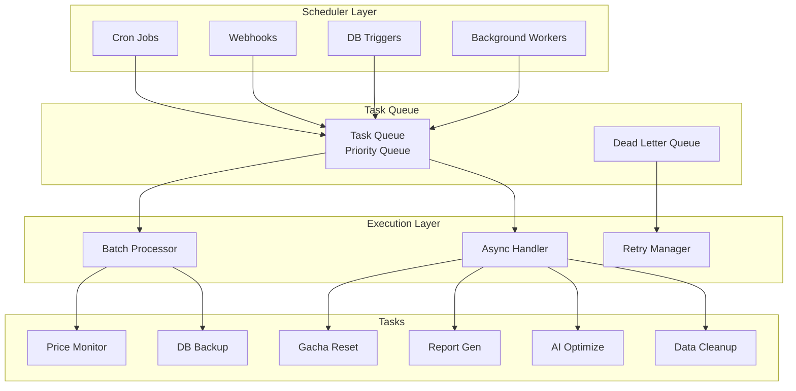
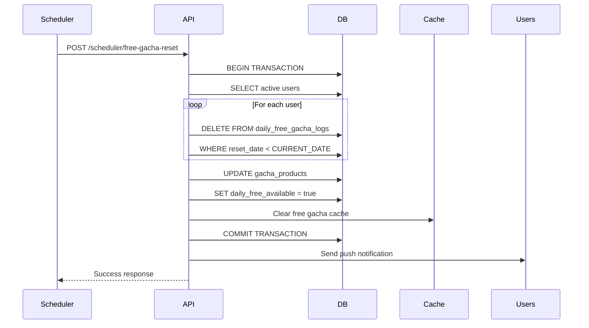
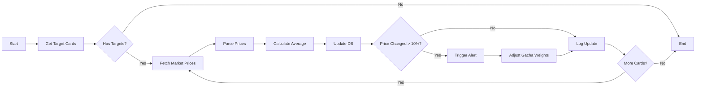

# 自動処理スケジューラ設計書 - Aceoripa Automation System

## 1. 自動処理システム概要

### 1.1 システム構成


### 1.2 スケジューラタイプ

| タイプ | 実行方式 | 用途 | 実装技術 |
|--------|---------|------|----------|
| 定期実行 | Cron式 | 定時バッチ処理 | GitHub Actions / Netlify Functions |
| イベント駆動 | Webhook/Trigger | リアルタイム処理 | Supabase Functions |
| 遅延実行 | Delayed Queue | 予約処理 | Bull Queue |
| 条件実行 | Conditional | 閾値監視 | Database Triggers |

## 2. 定期実行タスク設計

### 2.1 タスクスケジュール一覧

| タスク名 | 実行時間 | 頻度 | 優先度 | タイムアウト |
|---------|----------|------|--------|-------------|
| 無料ガチャリセット | 4:00 JST | 毎日 | 高 | 5分 |
| 価格監視更新 | */30分 | 30分毎 | 中 | 10分 |
| AI最適化分析 | 2:00 JST | 毎日 | 低 | 30分 |
| DBバックアップ | 3:00 JST | 毎日 | 高 | 60分 |
| レポート生成 | 9:00 JST | 毎日 | 中 | 15分 |
| キャッシュクリア | */6時間 | 6時間毎 | 低 | 5分 |
| ログローテーション | 0:00 JST | 毎日 | 低 | 10分 |
| 在庫同期 | */15分 | 15分毎 | 高 | 5分 |
| 統計集計 | 1:00 JST | 毎日 | 中 | 20分 |
| メール配信 | 10:00 JST | 毎週月曜 | 低 | 30分 |

### 2.2 Cron設定詳細

```yaml
# GitHub Actions (.github/workflows/scheduled-tasks.yml)
name: Scheduled Tasks

on:
  schedule:
    # 無料ガチャリセット（毎日4:00 JST = 19:00 UTC）
    - cron: '0 19 * * *'

    # 価格監視（30分毎）
    - cron: '*/30 * * * *'

    # AI最適化（毎日2:00 JST = 17:00 UTC）
    - cron: '0 17 * * *'

    # DBバックアップ（毎日3:00 JST = 18:00 UTC）
    - cron: '0 18 * * *'

jobs:
  daily-free-gacha-reset:
    runs-on: ubuntu-latest
    steps:
      - name: Reset Daily Free Gacha
        run: |
          curl -X POST ${{ secrets.API_URL }}/api/admin/scheduler/free-gacha-reset \
            -H "Authorization: Bearer ${{ secrets.SCHEDULER_TOKEN }}"

  price-monitoring:
    runs-on: ubuntu-latest
    steps:
      - name: Update Market Prices
        run: |
          curl -X POST ${{ secrets.API_URL }}/api/admin/price-monitoring/bulk-update \
            -H "Authorization: Bearer ${{ secrets.SCHEDULER_TOKEN }}"
```

## 3. 自動処理タスク詳細

### 3.1 無料ガチャリセット処理

#### 処理フロー


#### 実装コード
```typescript
// 無料ガチャリセット処理
export async function resetDailyFreeGacha(): Promise<void> {
  const resetTime = new Date();
  resetTime.setHours(4, 0, 0, 0); // 4:00 JST

  try {
    // トランザクション開始
    await supabase.rpc('begin_transaction');

    // 古いログを削除
    const { error: deleteError } = await supabase
      .from('daily_free_gacha_logs')
      .delete()
      .lt('reset_date', resetTime.toISOString().split('T')[0]);

    if (deleteError) throw deleteError;

    // ガチャ商品の無料フラグをリセット
    const { error: updateError } = await supabase
      .from('gacha_products')
      .update({
        metadata: {
          daily_free_reset_at: resetTime.toISOString()
        }
      })
      .eq('is_daily_free', true);

    if (updateError) throw updateError;

    // キャッシュクリア
    await clearCache('free-gacha:*');

    // コミット
    await supabase.rpc('commit_transaction');

    // プッシュ通知送信
    await sendBulkNotification({
      title: '無料ガチャがリセットされました！',
      body: '本日の無料ガチャが利用可能です',
      url: '/gacha'
    });

    logger.info('Daily free gacha reset completed', {
      resetTime,
      timestamp: new Date()
    });
  } catch (error) {
    await supabase.rpc('rollback_transaction');
    logger.error('Failed to reset daily free gacha', error);
    throw error;
  }
}
```

### 3.2 価格監視・更新処理

#### 処理フロー


#### 実装コード
```typescript
// 価格監視スケジューラ
export class PriceMonitorScheduler {
  private readonly PLATFORMS = ['cardrush', 'mercari', 'yahoo'];
  private readonly ALERT_THRESHOLD = 0.1; // 10%変動でアラート

  async execute(): Promise<void> {
    const startTime = Date.now();
    const results = {
      updated: 0,
      alerts: 0,
      errors: 0
    };

    try {
      // 監視対象カードを取得
      const targets = await this.getMonitoringTargets();

      // 並列処理で価格取得
      const priceUpdates = await Promise.allSettled(
        targets.map(target => this.fetchAndUpdatePrice(target))
      );

      // 結果処理
      for (const result of priceUpdates) {
        if (result.status === 'fulfilled') {
          results.updated++;
          if (result.value.alertTriggered) {
            results.alerts++;
          }
        } else {
          results.errors++;
          logger.error('Price update failed', result.reason);
        }
      }

      // 統計記録
      await this.recordStatistics(results, Date.now() - startTime);

    } catch (error) {
      logger.error('Price monitoring scheduler failed', error);
      throw error;
    }
  }

  private async fetchAndUpdatePrice(target: MonitoringTarget) {
    const prices = await Promise.all(
      this.PLATFORMS.map(platform =>
        this.scrapePrice(platform, target.cardId)
      )
    );

    const averagePrice = this.calculateWeightedAverage(prices);
    const previousPrice = target.currentPrice;
    const priceChange = (averagePrice - previousPrice) / previousPrice;

    // 価格更新
    await this.updateCardPrice(target.cardId, averagePrice);

    // アラート判定
    let alertTriggered = false;
    if (Math.abs(priceChange) > this.ALERT_THRESHOLD) {
      await this.triggerPriceAlert(target, priceChange);
      await this.adjustGachaWeights(target.cardId, priceChange);
      alertTriggered = true;
    }

    return { alertTriggered, priceChange };
  }
}
```

### 3.3 AI最適化処理

#### 最適化アルゴリズム
```typescript
// AI最適化スケジューラ
export class AIOptimizationScheduler {
  async execute(): Promise<void> {
    const activeGachas = await this.getActiveGachas();

    for (const gacha of activeGachas) {
      try {
        // 過去24時間のデータ収集
        const metrics = await this.collectMetrics(gacha.id, 24);

        // AI分析実行
        const optimization = await this.runOptimization(gacha, metrics);

        // 最適化適用判定
        if (this.shouldApplyOptimization(optimization)) {
          await this.applyOptimization(gacha.id, optimization);
          await this.notifyOptimizationApplied(gacha, optimization);
        }

        // 履歴記録
        await this.recordOptimizationHistory(gacha.id, optimization);

      } catch (error) {
        logger.error(`Optimization failed for gacha ${gacha.id}`, error);
      }
    }
  }

  private async runOptimization(gacha: Gacha, metrics: Metrics) {
    // 機械学習モデルによる最適化
    const features = this.extractFeatures(metrics);

    const optimization = {
      // 確率調整提案
      probabilityAdjustments: await this.calculateProbabilityAdjustments(features),

      // 価格調整提案
      priceAdjustments: await this.calculatePriceAdjustments(features),

      // 在庫調整提案
      stockAdjustments: await this.calculateStockAdjustments(features),

      // 予測メトリクス
      predictedRevenue: await this.predictRevenue(features),
      predictedSatisfaction: await this.predictSatisfaction(features),

      confidence: this.calculateConfidence(features)
    };

    return optimization;
  }
}
```

### 3.4 データベースバックアップ処理

#### バックアップ戦略
```typescript
// DBバックアップスケジューラ
export class DatabaseBackupScheduler {
  private readonly RETENTION_DAYS = {
    daily: 7,
    weekly: 30,
    monthly: 365
  };

  async execute(): Promise<void> {
    const backupId = generateBackupId();
    const timestamp = new Date();

    try {
      // フルバックアップ実行
      const backupUrl = await this.performBackup(backupId);

      // バックアップ検証
      await this.verifyBackup(backupUrl);

      // クロスリージョンレプリケーション
      await this.replicateToSecondaryRegion(backupUrl);

      // 古いバックアップの削除
      await this.cleanupOldBackups();

      // メタデータ記録
      await this.recordBackupMetadata({
        id: backupId,
        url: backupUrl,
        timestamp,
        size: await this.getBackupSize(backupUrl),
        type: this.getBackupType(timestamp)
      });

      logger.info('Database backup completed', { backupId });

    } catch (error) {
      await this.notifyBackupFailure(error);
      throw error;
    }
  }

  private getBackupType(date: Date): 'daily' | 'weekly' | 'monthly' {
    if (date.getDate() === 1) return 'monthly';
    if (date.getDay() === 0) return 'weekly';
    return 'daily';
  }
}
```

## 4. イベント駆動処理

### 4.1 Webhookトリガー

#### Square決済Webhook
```typescript
// 決済完了Webhook処理
export async function handlePaymentWebhook(
  request: Request
): Promise<Response> {
  try {
    // 署名検証
    const signature = request.headers.get('x-square-signature');
    if (!verifyWebhookSignature(signature, request.body)) {
      return new Response('Invalid signature', { status: 401 });
    }

    const event = await request.json();

    switch (event.type) {
      case 'payment.created':
        await handlePaymentCreated(event.data);
        break;

      case 'payment.updated':
        await handlePaymentUpdated(event.data);
        break;

      case 'refund.created':
        await handleRefundCreated(event.data);
        break;

      default:
        logger.warn('Unknown webhook event type', { type: event.type });
    }

    return new Response('OK', { status: 200 });

  } catch (error) {
    logger.error('Webhook processing failed', error);
    return new Response('Internal Server Error', { status: 500 });
  }
}

async function handlePaymentCreated(payment: Payment) {
  // ポイント付与処理
  await addUserPoints(payment.userId, payment.amount);

  // 領収書送信
  await sendReceipt(payment);

  // 統計更新
  await updateRevenueStatistics(payment);
}
```

### 4.2 データベーストリガー

#### 在庫変動トリガー
```sql
-- 在庫変動時の自動処理トリガー
CREATE OR REPLACE FUNCTION handle_stock_change()
RETURNS TRIGGER AS $$
DECLARE
  v_alert_threshold INTEGER := 10;
  v_reorder_threshold INTEGER := 5;
BEGIN
  -- 在庫僅少アラート
  IF NEW.current_stock < v_alert_threshold AND
     OLD.current_stock >= v_alert_threshold THEN

    INSERT INTO stock_alerts (
      card_id,
      alert_type,
      current_stock,
      threshold,
      created_at
    ) VALUES (
      NEW.card_id,
      'LOW_STOCK',
      NEW.current_stock,
      v_alert_threshold,
      NOW()
    );

    -- 管理者通知
    PERFORM pg_notify('stock_alert', json_build_object(
      'card_id', NEW.card_id,
      'stock', NEW.current_stock
    )::text);
  END IF;

  -- 自動再発注判定
  IF NEW.current_stock < v_reorder_threshold THEN
    INSERT INTO reorder_queue (
      card_id,
      suggested_quantity,
      priority,
      created_at
    ) VALUES (
      NEW.card_id,
      calculate_reorder_quantity(NEW.card_id),
      'HIGH',
      NOW()
    );
  END IF;

  RETURN NEW;
END;
$$ LANGUAGE plpgsql;

CREATE TRIGGER trigger_stock_change
  AFTER UPDATE OF current_stock ON gacha_pokemon_pools
  FOR EACH ROW
  EXECUTE FUNCTION handle_stock_change();
```

## 5. キュー管理システム

### 5.1 タスクキュー設計

```typescript
// タスクキュー管理クラス
export class TaskQueueManager {
  private queues: Map<string, Queue> = new Map();

  constructor() {
    this.initializeQueues();
  }

  private initializeQueues() {
    // 優先度別キュー作成
    this.queues.set('high', new Queue('high-priority', {
      concurrency: 10,
      retryDelay: 1000
    }));

    this.queues.set('medium', new Queue('medium-priority', {
      concurrency: 5,
      retryDelay: 5000
    }));

    this.queues.set('low', new Queue('low-priority', {
      concurrency: 2,
      retryDelay: 10000
    }));
  }

  async addTask(
    name: string,
    data: any,
    options: TaskOptions = {}
  ): Promise<string> {
    const priority = options.priority || 'medium';
    const queue = this.queues.get(priority);

    const job = await queue.add(name, data, {
      delay: options.delay,
      attempts: options.retries || 3,
      backoff: {
        type: 'exponential',
        delay: 2000
      },
      removeOnComplete: true,
      removeOnFail: false
    });

    return job.id;
  }

  // デッドレターキュー処理
  async processDeadLetterQueue(): Promise<void> {
    const failedJobs = await this.getFailedJobs();

    for (const job of failedJobs) {
      // リトライ回数確認
      if (job.attemptsMade >= job.opts.attempts) {
        // 手動介入が必要
        await this.notifyAdminOfFailedJob(job);
        await this.moveToManualQueue(job);
      } else {
        // 再試行
        await this.retryJob(job);
      }
    }
  }
}
```

### 5.2 ワーカー実装

```typescript
// バックグラウンドワーカー
export class BackgroundWorker {
  private isRunning = false;
  private workers: Worker[] = [];

  async start(): Promise<void> {
    this.isRunning = true;

    // ワーカープロセス起動
    const workerCount = os.cpus().length;
    for (let i = 0; i < workerCount; i++) {
      const worker = new Worker('./worker.js');
      worker.on('message', this.handleWorkerMessage.bind(this));
      worker.on('error', this.handleWorkerError.bind(this));
      this.workers.push(worker);
    }

    // タスク分配ループ
    while (this.isRunning) {
      const task = await this.getNextTask();
      if (task) {
        const worker = this.getAvailableWorker();
        worker.postMessage(task);
      } else {
        await this.sleep(1000);
      }
    }
  }

  private async getNextTask(): Promise<Task | null> {
    // 優先度順にタスク取得
    const priorities = ['high', 'medium', 'low'];

    for (const priority of priorities) {
      const task = await taskQueue.dequeue(priority);
      if (task) return task;
    }

    return null;
  }
}
```

## 6. 監視・アラート設定

### 6.1 監視項目

| 監視対象 | チェック間隔 | アラート条件 | 通知先 |
|---------|-------------|-------------|--------|
| タスク実行失敗 | リアルタイム | 3回連続失敗 | Slack, Email |
| タスクキュー滞留 | 5分 | 100件以上 | Slack |
| 実行時間超過 | リアルタイム | タイムアウト×1.5 | Email |
| メモリ使用率 | 1分 | 80%以上 | Slack |
| エラー率 | 5分 | 5%以上 | Slack, PagerDuty |

### 6.2 アラート実装

```typescript
// アラート管理システム
export class AlertManager {
  private readonly channels = {
    slack: new SlackNotifier(),
    email: new EmailNotifier(),
    pagerduty: new PagerDutyNotifier()
  };

  async sendAlert(alert: Alert): Promise<void> {
    // 重要度判定
    const severity = this.calculateSeverity(alert);

    // 通知チャンネル選択
    const channels = this.selectChannels(severity);

    // 並列送信
    await Promise.all(
      channels.map(channel =>
        this.channels[channel].send(alert)
      )
    );

    // アラート履歴記録
    await this.recordAlert(alert, severity);

    // エスカレーション判定
    if (severity === 'critical') {
      await this.escalate(alert);
    }
  }

  private calculateSeverity(alert: Alert): Severity {
    if (alert.type === 'SYSTEM_DOWN') return 'critical';
    if (alert.type === 'PAYMENT_FAILURE') return 'high';
    if (alert.failures > 10) return 'high';
    if (alert.failures > 5) return 'medium';
    return 'low';
  }
}
```

## 7. パフォーマンス最適化

### 7.1 並列処理戦略

```typescript
// 並列タスク実行
export class ParallelExecutor {
  async executeBatch<T>(
    tasks: Task[],
    options: { concurrency: number } = { concurrency: 10 }
  ): Promise<T[]> {
    const results: T[] = [];
    const executing: Promise<void>[] = [];

    for (const task of tasks) {
      const promise = this.executeTask(task).then(result => {
        results.push(result);
      });

      executing.push(promise);

      if (executing.length >= options.concurrency) {
        await Promise.race(executing);
        executing.splice(
          executing.findIndex(p => p === promise),
          1
        );
      }
    }

    await Promise.all(executing);
    return results;
  }
}
```

### 7.2 リソース管理

```typescript
// リソースプール管理
export class ResourcePool {
  private readonly pool: Resource[] = [];
  private readonly waiting: ((resource: Resource) => void)[] = [];

  async acquire(): Promise<Resource> {
    const resource = this.pool.pop();

    if (resource) {
      return resource;
    }

    // プールが空の場合は待機
    return new Promise(resolve => {
      this.waiting.push(resolve);
    });
  }

  release(resource: Resource): void {
    const waiter = this.waiting.shift();

    if (waiter) {
      waiter(resource);
    } else {
      this.pool.push(resource);
    }
  }

  // 自動クリーンアップ
  startCleanup(interval: number = 60000): void {
    setInterval(() => {
      const now = Date.now();
      this.pool = this.pool.filter(resource => {
        return now - resource.lastUsed < interval;
      });
    }, interval);
  }
}
```

## 8. エラーハンドリング・リカバリ

### 8.1 エラー処理戦略

```typescript
// エラーハンドラー
export class SchedulerErrorHandler {
  async handle(error: Error, context: TaskContext): Promise<void> {
    // エラー分類
    const errorType = this.classifyError(error);

    switch (errorType) {
      case 'TRANSIENT':
        // 一時的エラー → リトライ
        await this.scheduleRetry(context);
        break;

      case 'RATE_LIMIT':
        // レート制限 → 遅延実行
        await this.scheduleWithDelay(context, 60000);
        break;

      case 'FATAL':
        // 致命的エラー → 手動介入
        await this.notifyAdminAndStop(context, error);
        break;

      default:
        // 不明なエラー → ログ記録
        logger.error('Unknown error type', { error, context });
    }

    // エラーメトリクス更新
    await this.updateErrorMetrics(errorType);
  }

  private async scheduleRetry(context: TaskContext): Promise<void> {
    const retryCount = context.retryCount || 0;
    const delay = Math.pow(2, retryCount) * 1000; // Exponential backoff

    if (retryCount < 3) {
      await taskQueue.add(context.task, {
        ...context,
        retryCount: retryCount + 1,
        delay
      });
    } else {
      await this.moveToDeadLetterQueue(context);
    }
  }
}
```

### 8.2 サーキットブレーカー

```typescript
// サーキットブレーカー実装
export class CircuitBreaker {
  private state: 'CLOSED' | 'OPEN' | 'HALF_OPEN' = 'CLOSED';
  private failures = 0;
  private lastFailureTime?: Date;

  async execute<T>(
    fn: () => Promise<T>,
    options: CircuitBreakerOptions = {}
  ): Promise<T> {
    // サーキット開放中
    if (this.state === 'OPEN') {
      if (this.shouldAttemptReset()) {
        this.state = 'HALF_OPEN';
      } else {
        throw new Error('Circuit breaker is OPEN');
      }
    }

    try {
      const result = await fn();
      this.onSuccess();
      return result;
    } catch (error) {
      this.onFailure();
      throw error;
    }
  }

  private onSuccess(): void {
    this.failures = 0;
    this.state = 'CLOSED';
  }

  private onFailure(): void {
    this.failures++;
    this.lastFailureTime = new Date();

    if (this.failures >= 5) {
      this.state = 'OPEN';
      logger.warn('Circuit breaker opened', {
        failures: this.failures
      });
    }
  }

  private shouldAttemptReset(): boolean {
    if (!this.lastFailureTime) return false;
    const elapsed = Date.now() - this.lastFailureTime.getTime();
    return elapsed > 60000; // 1分後に再試行
  }
}
```

## 9. ログ・監査

### 9.1 ログ記録

```typescript
// スケジューラログ記録
export class SchedulerLogger {
  async logExecution(task: Task, result: TaskResult): Promise<void> {
    const logEntry = {
      taskId: task.id,
      taskName: task.name,
      startTime: result.startTime,
      endTime: result.endTime,
      duration: result.duration,
      status: result.status,
      error: result.error,
      metadata: task.metadata
    };

    // データベース記録
    await supabase
      .from('scheduler_logs')
      .insert(logEntry);

    // ファイルログ
    if (result.status === 'ERROR') {
      logger.error('Task execution failed', logEntry);
    } else {
      logger.info('Task execution completed', logEntry);
    }

    // メトリクス送信
    await this.sendMetrics(logEntry);
  }
}
```

### 9.2 監査ログ

```sql
-- スケジューラ監査テーブル
CREATE TABLE scheduler_audit_logs (
  id UUID PRIMARY KEY DEFAULT uuid_generate_v4(),
  task_name VARCHAR(255) NOT NULL,
  task_type VARCHAR(50) NOT NULL,
  executed_by VARCHAR(255) NOT NULL,
  execution_time TIMESTAMPTZ NOT NULL,
  duration_ms INTEGER,
  status VARCHAR(50) NOT NULL,
  affected_records INTEGER,
  error_message TEXT,
  metadata JSONB,
  created_at TIMESTAMPTZ DEFAULT CURRENT_TIMESTAMP
);

-- インデックス
CREATE INDEX idx_scheduler_audit_task_name ON scheduler_audit_logs(task_name);
CREATE INDEX idx_scheduler_audit_status ON scheduler_audit_logs(status);
CREATE INDEX idx_scheduler_audit_created_at ON scheduler_audit_logs(created_at);
```

## 10. 運用・保守

### 10.1 運用チェックリスト

- [ ] 全スケジュールタスクの実行確認（日次）
- [ ] エラーログの確認（日次）
- [ ] デッドレターキューの確認（週次）
- [ ] パフォーマンス指標の確認（週次）
- [ ] スケジュール見直し（月次）
- [ ] リソース使用状況の確認（月次）

### 10.2 トラブルシューティング

| 問題 | 原因 | 対処法 |
|------|------|--------|
| タスク未実行 | Cronジョブ停止 | GitHub Actions確認・再起動 |
| 実行遅延 | キュー滞留 | ワーカー数増加 |
| メモリリーク | リソース未解放 | ワーカー再起動 |
| DB接続エラー | コネクションプール枯渇 | プールサイズ調整 |
| API制限 | レート制限 | 実行間隔調整 |

---

*作成日: 2025年1月*
*バージョン: 1.0.0*
*作成者: Aceoripa開発チーム*