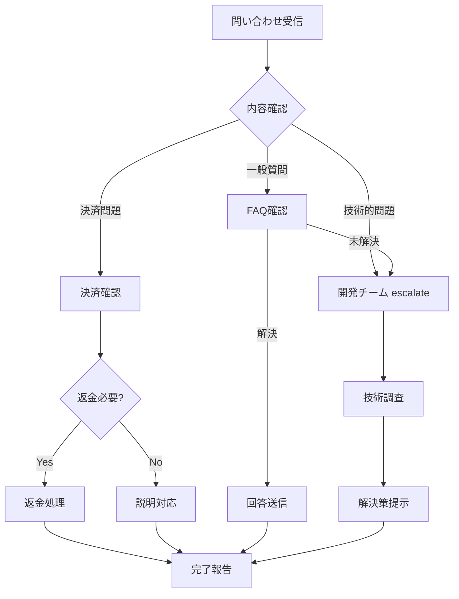

# サービス運用マニュアル - Aceoripa Service Operations

## 1. 運用概要

### 1.1 運用体制
```yaml
運用時間: 24時間365日
サポート時間: 平日9:00-18:00 JST
緊急対応: 24時間オンコール体制
```

### 1.2 役割分担
| 役割 | 責任範囲 | 必要権限 |
|------|---------|----------|
| サービス管理者 | 全体統括・意思決定 | 全権限 |
| 運用担当者 | 日常運用・監視 | 管理画面アクセス |
| カスタマーサポート | ユーザー対応 | 読み取り権限 |
| 開発者 | 機能開発・障害対応 | デプロイ権限 |

## 2. 日常運用業務

### 2.1 日次運用タスク

#### 朝の確認事項（9:00）
```markdown
□ 1. システム稼働状況確認
   - Netlify Status Dashboard確認
   - Supabase Dashboard確認
   - エラーログ確認

□ 2. 前日の運用状況確認
   - 売上集計確認
   - ユーザー登録数確認
   - ガチャ実行回数確認

□ 3. アラート確認
   - Slackアラート確認
   - メールアラート確認
   - 未処理チケット確認

□ 4. 無料ガチャリセット確認（4:00実行分）
   - リセット正常完了確認
   - エラーユーザー有無確認
```

#### 日中の監視業務（10:00-17:00）
```markdown
□ 1. リアルタイム監視
   - アクティブユーザー数監視
   - レスポンスタイム監視
   - エラー率監視

□ 2. カスタマーサポート
   - 問い合わせ対応
   - クレーム対応
   - 返金処理

□ 3. コンテンツ管理
   - ガチャ在庫確認
   - 新規ガチャ設定
   - キャンペーン設定
```

#### 夕方の締め作業（18:00）
```markdown
□ 1. 日次レポート作成
   - 売上レポート
   - ユーザー活動レポート
   - 障害レポート

□ 2. 翌日準備
   - キャンペーン設定確認
   - メンテナンス予定確認
   - 在庫補充確認

□ 3. 引き継ぎ事項記載
   - 未解決問題
   - 要注意ユーザー
   - 申し送り事項
```

### 2.2 週次運用タスク

#### 月曜日：週次レビュー
```bash
# 1. 前週の振り返り
- KPI達成状況確認
- 障害発生状況確認
- ユーザークレーム分析

# 2. 今週の計画確認
- リリース予定確認
- キャンペーン予定確認
- メンテナンス予定確認
```

#### 水曜日：パフォーマンスチェック
```bash
# 1. システムパフォーマンス
- ページ読み込み速度測定
- API応答時間測定
- データベース負荷確認

# 2. 最適化実施
- キャッシュクリア
- インデックス最適化
- 不要データ削除
```

#### 金曜日：バックアップ確認
```bash
# 1. バックアップ状態確認
- 自動バックアップ確認
- リストアテスト実施
- バックアップログ確認

# 2. セキュリティチェック
- アクセスログ確認
- 不正アクセス確認
- 権限設定確認
```

### 2.3 月次運用タスク

#### 月初（1-5日）
```markdown
□ 売上レポート作成
□ ユーザー分析レポート作成
□ システム利用状況レポート作成
□ 経営会議資料作成
```

#### 月中（15日前後）
```markdown
□ システムアップデート実施
□ セキュリティパッチ適用
□ パフォーマンステスト実施
□ 災害復旧訓練実施
```

#### 月末（25-31日）
```markdown
□ 翌月キャンペーン設定
□ 在庫調整
□ 請求書処理
□ 月次締め処理
```

## 3. ガチャ運営管理

### 3.1 新規ガチャ作成手順

#### Step 1: 企画立案
```yaml
必要情報:
  - ガチャ名称
  - 販売期間
  - 価格設定（単発/10連）
  - ターゲットユーザー層
  - 期待売上
```

#### Step 2: カードプール設定
```sql
-- 1. カード選定（最低50種類）
SELECT * FROM pokemon_cards
WHERE rarity IN ('SS', 'S', 'A', 'B')
ORDER BY market_price DESC;

-- 2. 確率配分
- SS: 1-2%
- S: 3-5%
- A: 10-15%
- B: 30-40%
- ポイント還元: 40-50%
```

#### Step 3: DOPA計算
```javascript
// 利益計算シミュレーション
const simulation = {
  totalPacks: 4000,
  pricePerPack: 10000,
  expectedRevenue: 40000000,
  actualReturnRate: 0.70,
  cardCost: 2000000,
  expectedProfit: 10000000
};
```

#### Step 4: テスト実施
```markdown
□ 単発ガチャテスト（10回）
□ 10連ガチャテスト（3回）
□ 演出確認
□ ポイント消費確認
□ 結果保存確認
```

#### Step 5: 本番公開
```bash
# 1. 管理画面でアクティブ化
# 2. キャッシュクリア
# 3. 告知実施
# 4. 初動モニタリング（1時間）
```

### 3.2 ガチャ在庫管理

#### 在庫監視
```sql
-- 残り10%以下のガチャ確認
SELECT
  name,
  total_packs,
  remaining_packs,
  ROUND(remaining_packs::numeric / total_packs * 100, 2) as remaining_percent
FROM gacha_products
WHERE is_active = true
  AND remaining_packs < total_packs * 0.1
ORDER BY remaining_percent;
```

#### 在庫補充手順
```markdown
1. 売れ行き分析
2. 追加数量決定（500-1000パック）
3. カードプール調整
4. 利益計算再実施
5. 在庫追加実行
6. 告知実施
```

### 3.3 価格調整

#### 市場価格モニタリング
```bash
# 自動実行（30分毎）
curl -X POST https://ace-oripa.com/api/admin/price-monitoring/bulk-update \
  -H "Authorization: Bearer $ADMIN_TOKEN"
```

#### 価格変動対応
| 変動率 | 対応 |
|--------|------|
| +50%以上 | 確率を50%減少 |
| +20-50% | 確率を30%減少 |
| -20%以下 | 確率を20%増加 |
| -50%以下 | ガチャから除外検討 |

## 4. ユーザー管理

### 4.1 ユーザーサポート対応

#### 問い合わせ対応フロー


#### よくある問い合わせと対応

| 問い合わせ内容 | 対応方法 | 対応時間目安 |
|---------------|---------|-------------|
| ポイントが反映されない | 決済履歴確認→手動付与 | 30分 |
| ガチャ結果が表示されない | キャッシュクリア案内 | 10分 |
| ログインできない | パスワードリセット案内 | 10分 |
| 返金希望 | 利用規約確認→個別判断 | 1時間 |
| カードが重複した | 仕様説明 | 10分 |

### 4.2 VIPユーザー管理

#### VIP基準
```sql
-- 月間10万円以上課金ユーザー
SELECT
  u.email,
  u.display_name,
  SUM(t.amount) as total_spent
FROM users u
JOIN transactions t ON u.id = t.user_id
WHERE t.created_at >= CURRENT_DATE - INTERVAL '30 days'
  AND t.status = 'completed'
GROUP BY u.id, u.email, u.display_name
HAVING SUM(t.amount) >= 100000
ORDER BY total_spent DESC;
```

#### VIP特典
- 専用サポート窓口
- 先行情報提供
- 限定ガチャアクセス
- ポイントボーナス（+10%）

### 4.3 不正ユーザー対策

#### 監視項目
```yaml
異常行動パターン:
  - 1分間に10回以上のAPI呼び出し
  - 同一IPから複数アカウント作成
  - 決済後即返金の繰り返し
  - 自動化ツールの使用疑い
```

#### 対応手順
```markdown
1. 警告通知（1回目）
2. 一時利用停止（24時間）
3. アカウント凍結（2回目）
4. 永久BAN（悪質な場合）
```

## 5. 決済管理

### 5.1 決済処理監視

#### Square Dashboard確認
```markdown
毎日10:00と16:00に確認:
□ 前日の決済件数・金額
□ 失敗した決済の確認
□ 返金処理の確認
□ チャージバック有無
```

#### 決済エラー対応
```javascript
// エラーコード別対応
const paymentErrorHandling = {
  'CARD_DECLINED': '別のカードを案内',
  'INSUFFICIENT_FUNDS': '残高確認を案内',
  'INVALID_CARD': 'カード情報再入力案内',
  'PROCESSING_ERROR': '時間を置いて再試行案内',
  'RATE_LIMITED': 'システム側で対応'
};
```

### 5.2 返金処理

#### 返金ポリシー
```markdown
返金可能条件:
- 購入後未使用のポイント
- システム障害による損失
- 誤購入（24時間以内）

返金不可条件:
- ガチャ実行後
- 購入後24時間経過
- 利用規約違反
```

#### 返金処理手順
```bash
# 1. 返金申請確認
# 2. 利用履歴確認
# 3. 管理者承認
# 4. Square APIで返金実行
# 5. ポイント回収
# 6. 完了通知送信
```

## 6. キャンペーン管理

### 6.1 キャンペーン種類

| 種類 | 実施頻度 | 効果 |
|------|---------|------|
| 初回購入ボーナス | 常設 | 新規獲得 |
| 期間限定ガチャ | 月2回 | 売上増加 |
| ポイント増量 | 月1回 | 課金促進 |
| 無料ガチャ増量 | 週末 | アクティブ率向上 |

### 6.2 キャンペーン設定手順

```sql
-- 1. キャンペーンバナー設定
INSERT INTO campaign_banners (
  title,
  description,
  image_url,
  start_date,
  end_date
) VALUES (
  '週末限定！ポイント20%増量',
  '期間中のポイント購入で20%ボーナス',
  '/images/campaign/weekend-bonus.jpg',
  '2025-01-17 00:00:00',
  '2025-01-19 23:59:59'
);

-- 2. ポイントパッケージ調整
UPDATE point_packages
SET bonus_rate = 0.20
WHERE id IN (SELECT id FROM point_packages);
```

## 7. 障害対応

### 7.1 障害レベル定義

| レベル | 状況 | 対応時間 | 対応者 |
|--------|------|----------|--------|
| Critical | サービス停止 | 即時 | 全員 |
| High | 決済不可 | 30分以内 | 開発+運用 |
| Medium | 一部機能不可 | 2時間以内 | 運用 |
| Low | 軽微な不具合 | 翌営業日 | 運用 |

### 7.2 障害対応フロー

#### 1. 初動対応（5分以内）
```bash
# 状況確認
curl https://ace-oripa.com/api/health

# ログ確認
netlify logs --tail

# エラー率確認
SELECT COUNT(*) FROM error_logs
WHERE created_at >= NOW() - INTERVAL '5 minutes';
```

#### 2. 影響範囲特定（15分以内）
```markdown
□ 影響ユーザー数確認
□ 影響機能特定
□ 売上影響試算
□ 原因仮説立案
```

#### 3. 暫定対応（30分以内）
```markdown
□ メンテナンスモード切替（必要時）
□ 問題機能の無効化
□ ユーザー告知実施
□ キャッシュクリア
```

#### 4. 本対応
```markdown
□ 根本原因特定
□ 修正実施
□ テスト実施
□ 本番適用
□ 動作確認
```

#### 5. 事後対応
```markdown
□ 障害報告書作成
□ 再発防止策検討
□ ユーザー補償検討
□ 振り返り会実施
```

### 7.3 緊急連絡先

```yaml
エスカレーション順序:
  1. 運用担当者: 080-XXXX-XXXX
  2. 開発リーダー: 090-XXXX-XXXX
  3. サービス責任者: 070-XXXX-XXXX

外部連絡先:
  - Supabase Support: support@supabase.com
  - Square Support: 0120-XXX-XXX
  - Netlify Support: support@netlify.com
```

## 8. データ管理

### 8.1 バックアップ運用

#### 自動バックアップ
```yaml
Daily Backup:
  時刻: 3:00 JST
  保持期間: 7日
  対象: 全データ

Weekly Backup:
  時刻: 日曜 3:00 JST
  保持期間: 30日
  対象: 全データ

Monthly Backup:
  時刻: 月初 3:00 JST
  保持期間: 365日
  対象: 全データ + ログ
```

#### リストア手順
```bash
# 1. バックアップリスト確認
supabase db backups list

# 2. リストアポイント選択
supabase db restore --backup-id [BACKUP_ID]

# 3. データ整合性確認
SELECT COUNT(*) FROM users;
SELECT COUNT(*) FROM transactions;
SELECT COUNT(*) FROM pokemon_cards;

# 4. サービス再開
```

### 8.2 データクレンジング

#### 月次クレンジング
```sql
-- 90日以上前のログ削除
DELETE FROM activity_logs
WHERE created_at < CURRENT_DATE - INTERVAL '90 days';

-- 失敗した決済の削除（1年以上前）
DELETE FROM transactions
WHERE status = 'failed'
  AND created_at < CURRENT_DATE - INTERVAL '365 days';

-- 未使用アカウントの無効化（6ヶ月）
UPDATE users
SET is_active = false
WHERE last_login_at < CURRENT_DATE - INTERVAL '180 days';
```

## 9. レポート作成

### 9.1 日次レポート

```markdown
## 日次運用レポート - [日付]

### 1. KPI
- 売上: ¥XXX,XXX
- DAU: X,XXX人
- 新規登録: XXX人
- ガチャ実行: X,XXX回

### 2. 障害・問題
- [問題内容と対応状況]

### 3. ユーザーボイス
- [主な問い合わせ内容]

### 4. 明日の予定
- [予定されている作業]
```

### 9.2 週次レポート

```markdown
## 週次レポート - [期間]

### 1. 週間サマリー
- 総売上: ¥X,XXX,XXX
- 週間アクティブユーザー: XX,XXX人
- 平均ARPU: ¥X,XXX

### 2. ガチャ別売上
| ガチャ名 | 売上 | 実行回数 | 転換率 |
|---------|------|---------|--------|
| [データ] | | | |

### 3. 改善提案
- [データに基づく改善案]

### 4. 来週の重点施策
- [計画]
```

### 9.3 月次レポート

```markdown
## 月次運用レポート - [年月]

### エグゼクティブサマリー
[1ページでまとめた概要]

### 1. 財務指標
- 月間売上: ¥XX,XXX,XXX
- 前月比: +XX%
- 利益率: XX%

### 2. ユーザー指標
- MAU: XXX,XXX人
- 新規獲得: X,XXX人
- 継続率: XX%

### 3. サービス品質
- 稼働率: 99.X%
- 平均応答時間: XXXms
- エラー率: 0.X%

### 4. 主要施策と結果
[実施した施策と効果]

### 5. 来月の計画
[予定している施策]
```

## 10. ツール・リソース

### 10.1 管理ツール一覧

| ツール名 | URL | 用途 |
|---------|-----|------|
| Netlify Dashboard | https://app.netlify.com | デプロイ管理 |
| Supabase Dashboard | https://app.supabase.com | DB管理 |
| Square Dashboard | https://squareup.com/dashboard | 決済管理 |
| Google Analytics | https://analytics.google.com | アクセス解析 |
| Slack | aceoripa.slack.com | コミュニケーション |

### 10.2 ドキュメント

```markdown
/docs
├── 01_BASIC_DESIGN.md         # 基本設計書
├── 02_INFRASTRUCTURE.md       # インフラ構成
├── 03_DATABASE_DESIGN.md      # DB設計
├── 04_DETAILED_DESIGN.md      # 詳細設計
├── 05_SCHEDULER.md            # スケジューラ設計
├── 06_SERVICE_OPERATION.md    # 本マニュアル
└── 07_SYSTEM_OPERATION.md     # システム操作マニュアル
```

### 10.3 チェックリストテンプレート

```markdown
## デイリーチェックリスト

日付: ____年__月__日
担当者: __________

### 朝（9:00）
- [ ] システム稼働確認
- [ ] エラーログ確認
- [ ] 前日売上確認
- [ ] アラート確認

### 昼（12:00）
- [ ] リアルタイム監視
- [ ] 問い合わせ対応
- [ ] 在庫確認

### 夕（18:00）
- [ ] 日次レポート作成
- [ ] 引き継ぎ事項記載
- [ ] 翌日準備確認

備考:
_________________________
```

## 11. トラブルシューティング

### 11.1 よくあるトラブルと対処法

| 症状 | 原因 | 対処法 |
|------|------|--------|
| ページが表示されない | CDNエラー | Netlifyステータス確認→キャッシュクリア |
| ログインできない | Auth障害 | Supabase Auth確認→手動リセット |
| 決済が通らない | Square API障害 | Square Status確認→Fincode切替 |
| ガチャが引けない | 在庫切れ | 在庫補充→キャッシュクリア |
| 画像が表示されない | Storage障害 | Supabase Storage確認→CDN切替 |

### 11.2 緊急時対応マニュアル

#### サービス完全停止時
```bash
# 1. 静的メンテナンスページ表示
netlify deploy --prod --dir=maintenance

# 2. ユーザー告知（Twitter/メール）
"現在、システムメンテナンスを実施しております。
ご迷惑をおかけし申し訳ございません。"

# 3. 原因調査・復旧作業

# 4. サービス再開
netlify deploy --prod

# 5. お詫び対応（ポイント配布等）
```

---

*作成日: 2025年1月*
*バージョン: 1.0.0*
*最終更新: 2025年1月*
*作成者: Aceoripa運用チーム*